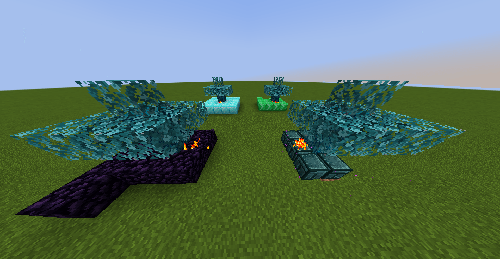
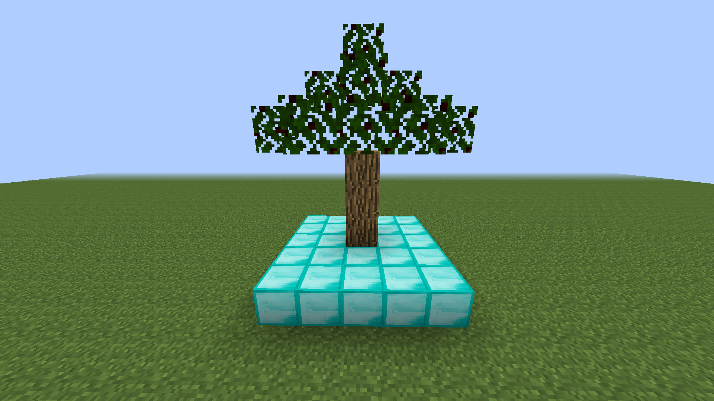
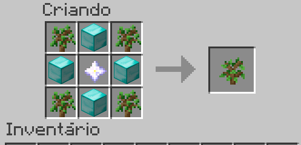

# Block Duplicator Tree


<p align="center">
  
  
  
  
</p>

<p align="center">
  A cross-version monorepo for the new generation of <strong>Block Duplicator Tree</strong>, including modern Forge/Fabric ports and legacy Forge fallback builds.
</p>

## Overview

`Block Duplicator Tree` adds a special tree whose trunk can duplicate placeable blocks in a `5x5` area around it.

Core behavior implemented in this repository:

- Natural rare spawn under caves in `Lush Caves` for modern versions where that biome exists.
- Vanilla-style small tree silhouette with a `4-block` trunk.
- Tree regrowth from a single placed log after `20 minutes`.
- Full duplication cycle in `10 minutes`.
- New duplication cycle only starts after the trigger block is removed and placed again.
- Legacy-compatible fallback behavior for old Minecraft branches that do not have `Lush Caves`.

## Screenshots

| Modern Showcase | Legacy 1.7.10 |
| --- | --- |
|  |  |

| Crafting / concept reference |
| --- |
|  |

## Supported Targets

### Forge

| Version | Status | Notes |
| --- | --- | --- |
| `1.7.10` | Ready | Legacy fallback, no `Lush Caves` worldgen |
| `1.12.2` | Ready | Legacy fallback, no `Lush Caves` worldgen |
| `1.16.5` | Ready | Legacy fallback, no `Lush Caves` worldgen |
| `1.19.4` | Ready | Modern gameplay line |
| `1.20.1` | Ready | Modern gameplay line |
| `1.21` | Ready | Modern gameplay line |
| `1.21.1` | Ready | Modern gameplay line |
| `1.21.3` | Ready | Modern gameplay line |
| `1.21.4` | Ready | Modern gameplay line |
| `1.21.5` | Ready | Modern gameplay line |
| `1.21.6` | Ready | Modern gameplay line |

### Fabric

| Version | Status | Notes |
| --- | --- | --- |
| `1.20.1` | Ready | Fabric port |
| `1.21` | Ready | Fabric port |
| `1.21.1` | Ready | Fabric port |
| `1.21.2` | Ready | Fabric port |
| `1.21.3` | Ready | Fabric port |
| `1.21.4` | Ready | Fabric port |
| `1.21.5` | Ready | Fabric port |
| `1.21.6` | Ready | Fabric port |

Important note:
`Forge 1.21.2` is not included because there was no official Forge build available for that patch line during repository assembly.

## Repository Layout

```text
TreeDuplicator/
|-- docs/
|   |-- gameplay-spec.md
|   |-- version-matrix.md
|   `-- images/
|-- scripts/
|   |-- package-release-assets.ps1
|   `-- create-github-release.ps1
`-- versions/
    |-- forge-*/
    `-- fabric-*/
```

## Build

### Java Requirements

- `JDK 21` for modern Forge/Fabric modules
- `JDK 8` for `Forge 1.12.2` and `Forge 1.7.10`

### Example: modern module

```powershell
cd versions/forge-1.20.1
$env:JAVA_HOME='C:\Users\happi\Documents\.modding\Minecraft\TreeDuplicator\.jdks\jdk-21.0.10+7'
.\gradlew.bat build
```

### Example: legacy module

```powershell
cd versions/forge-1.12.2
$env:JAVA_HOME='C:\Users\happi\Documents\.modding\Minecraft\TreeDuplicator\.jdks\jdk8\jdk8u482-b08'
.\gradlew.bat build
```

## Packaging Releases

This repository includes a packaging script that collects the generated jars and renames them into release-safe filenames:

```powershell
.\scripts\package-release-assets.ps1
```

It produces versioned assets inside:

```text
dist/v0.1.0-alpha/
```

Examples of packaged filenames:

- `blockduplicatortree-forge-1.20.1-0.1.0-alpha.jar`
- `blockduplicatortree-fabric-1.21.6-0.1.0-alpha.jar`

## Publishing To GitHub

First-time setup:

```powershell
gh auth login
```

Then create the repository and push the monorepo:

```powershell
.\scripts\create-github-repo.ps1 -Owner "YOUR_USER" -Visibility public
```

After authenticating the GitHub CLI, publish the aggregated release with:

```powershell
.\scripts\create-github-release.ps1 -Repo "YOUR_USER/TreeDuplicatorMod"
```

The script:

- packages all final jars with unique names
- creates or updates tag `v0.1.0-alpha`
- uploads all packaged jars as GitHub release assets

## Docs

- [Gameplay Spec](docs/gameplay-spec.md)
- [Version Matrix](docs/version-matrix.md)

## CurseForge Reference

Current public project reference:

- [Block Duplicator Tree on CurseForge](https://www.curseforge.com/minecraft/mc-mods/block-duplicator-tree)

Some screenshots in this repository were captured from the current public project page for documentation purposes.
