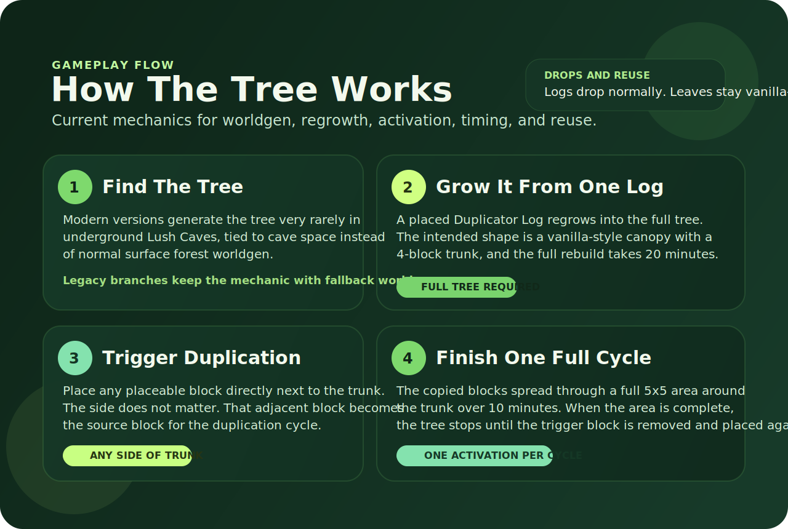

# Block Duplicator Tree


<p align="center">
  
  
  
  
</p>

<p align="center">
  A cross-version monorepo for the current generation of <strong>Block Duplicator Tree</strong>: a rare underground tree that regrows from a single log and duplicates nearby placeable blocks over time.
</p>

## Overview

`Block Duplicator Tree` adds a special tree whose trunk can duplicate any placeable block in a timed `5x5` cycle.

The intended player loop is:

- find the rare underground tree
- harvest it like a normal tree
- place one of its logs back in the world
- wait for the tree to regrow
- place any block touching the trunk
- let the tree complete one full duplication cycle

## Mechanics At A Glance



## How The Tree Works

### Natural Spawn

- In modern gameplay branches, the tree is designed to generate very rarely in `Lush Caves`.
- Its spawn pattern is tied to underground cave space rather than normal surface forest generation.
- In legacy Minecraft branches that do not include `Lush Caves`, this repository keeps the core duplication mechanic and uses fallback behavior instead of biome-accurate worldgen.

### Tree Appearance

- The tree keeps a vanilla-style silhouette instead of a giant fantasy model.
- The trunk is `4 blocks` tall.
- The leaves are meant to read like a normal Minecraft tree canopy.
- The duplication behavior belongs to the tree's `log / trunk` block.

### Regrowth From A Single Log

- A placed `Duplicator Log` can rebuild the full tree by itself.
- The tree must finish rebuilding before duplication becomes available.
- The intended regrowth time is `20 minutes`.
- Regrowth restores the normal tree shape described above.

### Triggering Duplication

- Once the tree is fully regrown, place any placeable block directly next to the trunk.
- The side does not matter; touching any side of the trunk is enough to trigger the effect.
- That placed block becomes the source block for the duplication cycle.
- The tree then expands that block through a `5x5` area centered around the trunk / tree footprint.

### Duplication Rules

- One activation produces one full `5x5` duplication cycle.
- The intended full-cycle time is `10 minutes`.
- When the `5x5` area is complete, the tree stops duplicating.
- To start a new cycle, the adjacent trigger block must be removed and placed again.
- The tree is meant to duplicate placeable blocks only; the log itself is the activator, not the duplicated target.

### Breaking, Drops, And Reuse

- The tree can be broken like a normal Minecraft tree.
- Logs drop like normal wood blocks.
- Leaves are intended to behave like normal leaves, including shears-based collection.
- The important reusable item is the `Duplicator Log`, because placing it back down starts the regrowth cycle again.

## Gameplay Timing

| Action | Intended Time | Notes |
| --- | --- | --- |
| Tree regrowth from a placed log | `20 minutes` | Tree must finish regrowing before duplication works |
| Full `5x5` duplication cycle | `10 minutes` | One cycle per activation |

## Supported Targets

### Forge

| Version | Status | Notes |
| --- | --- | --- |
| `1.7.10` | Ready | Legacy fallback, no `Lush Caves` worldgen |
| `1.12.2` | Ready | Legacy fallback, no `Lush Caves` worldgen |
| `1.16.5` | Ready | Legacy fallback, no `Lush Caves` worldgen |
| `1.19.4` | Ready | Modern gameplay line |
| `1.20.1` | Ready | Modern gameplay line |
| `1.21` | Ready | Modern gameplay line |
| `1.21.1` | Ready | Modern gameplay line |
| `1.21.3` | Ready | Modern gameplay line |
| `1.21.4` | Ready | Modern gameplay line |
| `1.21.5` | Ready | Modern gameplay line |
| `1.21.6` | Ready | Modern gameplay line |

### Fabric

| Version | Status | Notes |
| --- | --- | --- |
| `1.20.1` | Ready | Fabric port |
| `1.21` | Ready | Fabric port |
| `1.21.1` | Ready | Fabric port |
| `1.21.2` | Ready | Fabric port |
| `1.21.3` | Ready | Fabric port |
| `1.21.4` | Ready | Fabric port |
| `1.21.5` | Ready | Fabric port |
| `1.21.6` | Ready | Fabric port |

Important note:
`Forge 1.21.2` is not included because there was no official Forge build available for that patch line during repository assembly.

## Repository Layout

```text
TreeDuplicator/
|-- docs/
|   |-- gameplay-spec.md
|   |-- version-matrix.md
|   `-- images/
|-- scripts/
|   |-- package-release-assets.ps1
|   |-- create-github-repo.ps1
|   `-- create-github-release.ps1
`-- versions/
    |-- forge-*/
    `-- fabric-*/
```

## Build

### Java Requirements

- `JDK 21` for modern Forge and Fabric modules
- `JDK 8` for `Forge 1.12.2` and `Forge 1.7.10`

### Example: modern module

```powershell
cd versions/forge-1.20.1
$env:JAVA_HOME='C:\Users\happi\Documents\.modding\Minecraft\TreeDuplicator\.jdks\jdk-21.0.10+7'
.\gradlew.bat build
```

### Example: legacy module

```powershell
cd versions/forge-1.12.2
$env:JAVA_HOME='C:\Users\happi\Documents\.modding\Minecraft\TreeDuplicator\.jdks\jdk8\jdk8u482-b08'
.\gradlew.bat build
```

## Packaging Releases

This repository includes a packaging script that collects the generated jars and renames them into release-safe filenames:

```powershell
.\scripts\package-release-assets.ps1
```

It produces versioned assets inside:

```text
dist/v0.1.0-alpha/
```

Examples of packaged filenames:

- `blockduplicatortree-forge-1.20.1-0.1.0-alpha.jar`
- `blockduplicatortree-fabric-1.21.6-0.1.0-alpha.jar`

## Publishing To GitHub

First-time setup:

```powershell
gh auth login
```

Then create the repository and push the monorepo:

```powershell
.\scripts\create-github-repo.ps1 -Owner "YOUR_USER" -Visibility public
```

After authenticating the GitHub CLI, publish the aggregated release with:

```powershell
.\scripts\create-github-release.ps1 -Repo "YOUR_USER/TreeDuplicatorMod"
```

The release script:

- packages all final jars with unique names
- creates or updates tag `v0.1.0-alpha`
- uploads all packaged jars as GitHub release assets

## Docs

- [Gameplay Spec](docs/gameplay-spec.md)
- [Version Matrix](docs/version-matrix.md)

## CurseForge Reference

Current public project reference:

- [Block Duplicator Tree on CurseForge](https://www.curseforge.com/minecraft/mc-mods/block-duplicator-tree)

This README now uses generated repository artwork instead of old CurseForge screenshots so the visuals stay aligned with the current gameplay rules.
